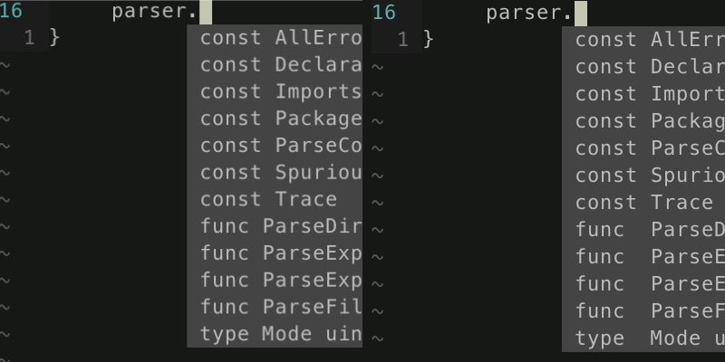

# deoplete-go

|| **Status** |
|:---:|:---:|
| **Travis CI** |[](https://travis-ci.org/zchee/deoplete-go)|
| **Gitter** |[](https://gitter.im/zchee/deoplete-go?utm_source=badge&utm_medium=badge&utm_campaign=pr-badge&utm_content=badge)|

Go source for [deoplete.nvim](https://github.com/Shougo/deoplete.nvim) use [gocode](https://github.com/nsf/gocode).

## Overview
Asynchronous Go completion for Neovim.  
Use,

### deoplete.nvim
[Shougo/deoplete.nvim](https://github.com/Shougo/deoplete.nvim)

Dark powered asynchronous completion framework for neovim.  
Fastetst, Fully asynchronous, Nonblocking user interface, Customizable source for each languages, and more.  
The Nextgen word completion.

### gocode
[nsf/gocode](https://github.com/nsf/gocode)

An autocompletion daemon for the Go programming language.  
Fastest, Context-sesinive, Server/Client architecture, Result caching.  
The defact standard completion engine.

===

## Required

### Neovim and neovim/python-client
https://github.com/neovim/neovim  
https://github.com/neovim/python-client

### deoplete.nvim
https://github.com/Shougo/deoplete.nvim

### gocode
https://github.com/nsf/gocode

===

## How to install

### 1. Install Neovim
See Neovim wiki.

- [Installing Neovim](https://github.com/neovim/neovim/wiki/Installing-Neovim)
- [Following HEAD](https://github.com/neovim/neovim/wiki/Following-HEAD)
- [Building](https://github.com/neovim/neovim/wiki/Building-Neovim)

### 2. Install neovim/python-client
Neovim remonte client for python.  
See https://github.com/neovim/python-client

```bash
pip2 install --upgrade neovim
pip3 install --upgrade neovim
```

### 3. Install latest of gocode

```bash
go get -u github.com/nsf/gocode
```

### 4. Install plugin and Build ujson module
`deoplete-go` using [esnme/ultrajson](https://github.com/esnme/ultrajson) json module.  
It's Python bindings for C library. Need compiling.  
So, If you use Plugin manager supported build process, set `make` commmand.

```vim
" dein.vim
call dein#add('Shougo/deoplete.nvim')
call dein#add('zchee/deoplete-go', {'build': 'make'})

" NeoBundle
NeoBundle 'Shougo/deoplete.nvim'}
NeoBundle 'zchee/deoplete-go', {'build': {'unix': 'make'}}

" vim-plug
Plug 'Shougo/deoplete.nvim'
Plug 'zchee/deoplete-go', { 'do': 'make'}
```

===

## Available Settings

| Setting value                         | Default | Required  |
|:--------------------------------------|:-------:|:---------:|
| `g:deoplete#sources#go#align_class`   | `0`     | No        |
| `g:deoplete#sources#go#gocode_binary` | `''`    | Recommend |
| `g:deoplete#sources#go#package_dot`   | `0`     | No        |
| `g:deoplete#sources#go#sort_class`    | `[]`    | Recommend |

### `g:deoplete#sources#go#align_class`
#### Class Aligning



| **Default**  | `0` |
|--------------|-----|
| **Required** | No  |
| **Type**     | int |
| **Example**  | `1` |

By default, the classes (const, func, type, var) are not aligned in the popup menu.  
In Screenshot, First is unaligned, second is aligned.  
If you would like them aligned just set:
```vim
let g:deoplete#sources#go#align_class = 1
```

### `g:deoplete#sources#go#gocode_binary`
#### `gocode` Binary

| **Default**  | `''`                    |
|--------------|-------------------------|
| **Required** | **Recommend**           |
| **Type**     | string                  |
| **Example**  | `$GOPATH.'/bin/gocode'` |

`deoplete-go` will directly call `gocode`. Not vim bypass due to the omnifunc.  
By default(not set), Find the gocode binary in `$PATH` environment.  
This setting is **Recommend**.  
If you set it, `deoplete-go` spared look for the binary. It will improve performance.

Also, If you want to use a different from the first found `gocode` binary from `$PATH` then set:
```vim
let g:deoplete#sources#go#gocode_binary = '/path/to/gocode'
```

### `g:deoplete#sources#go#package_dot`
#### Automatically insert dot for after package name

| **Default**  | `0` |
|--------------|-----|
| **Required** | No  |
| **Type**     | int |
| **Example**  | `1` |

Automatically insert dot(period) when you select `package` name in popup menu.  
By default, no dot(period) is inserted after a package name.

If you would prefer adding a period then set:
```vim
let g:deoplete#sources#go#package_dot = 1
```

### `g:deoplete#sources#go#sort_class`
#### Class Sorting and Ignore

| **Default**  | `[]`               |
|--------------|--------------------|
| **Required** | **Recommend**      |
| **Type**     | list               |
| **Example**  | See bellow exmaple |

By befault, the completion word list is in the sort order of gocode. Same as omnifunc.  
If you want to change it to an arbitrary order, set it.

Available values are [`package`, `func`, `type`, `var`, `const`].  
If you did not include any value, it will always be hidden in the completion list.

To display all words while sorting, set:
```vim
let g:deoplete#sources#go#sort_class = ['package', 'func', 'type', 'var', 'const']
```

Try test it with the `os` package :)

===

## Sample init.vim

```vim
" neocomplete like
set completeopt+=noinsert
" deoplete.nvim recommend
set completeopt+=noselect

" Path to python interpreter for neovim
let g:python3_host_prog  = '/path/to/python3'
" Skip the check of neovim module
let g:python3_host_skip_check = 1

" Run deoplete.nvim automatically
let g:deoplete#enable_at_startup = 1
" deoplete-go settings
let g:deoplete#sources#go#gocode_binary = $GOPATH.'/bin/gocode'
let g:deoplete#sources#go#sort_class = ['package', 'func', 'type', 'var', 'const']
```

===

TODO:
-----
- [ ] Parse included cgo (C, C++ language) headers on current buffer
  - `ctags` will be blocking `deoplete.nvim`
- [ ] Support static json caching
  - See https://github.com/zchee/deoplete-go/pull/19
- [x] Support Go stdlib package `import "***"` name completion
  - This feature has been implemented in gocode. Thanks @nhooyr!
- [x] Execute `gocode` binary instead of call vim function
- [x] Get and parse completion list of json format. such as `ycm`
- [x] When there is no candidate infomation, deoplete will cause an error
- [x] Support fizzy matching
